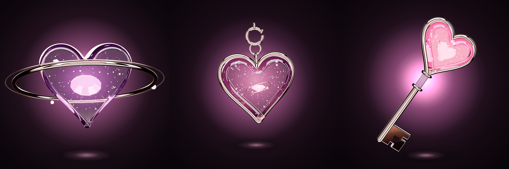

# VIBE — NFT Genesis Collection (TON / Getgems)

> **REAL CONNECTIONS ONLY.** 30 one-of-one romantic collectibles: rose gold, crystal, pearl, satin.



## Структура

```
vibe-nft/
  assets/        финальные файлы для загрузки: <id>/master_2048.png (прозрачный), master_velvet_2048.png,
                 marketplace_1000.png, animation_1000.mp4 · collection/avatar_1000.png, cover_2400x800.png
  metadata/      30 × item metadata (TEP-64, Getgems), URL — плейсхолдеры <UPLOAD_BASE_URI>
  prompts/       30 × production-промпт (master, negative, animation, QC)
  previews/      контакт-листы, тест силуэтов 64 px, раскадровка лупа
  collection/    catalog.py — единый источник данных · generate.py · collection.json
  docs/          DESIGN_SYSTEM · HEROES · CATALOG · ATTRIBUTES · PRODUCTION
  engine/        3D-движок: studio.js (свет, материалы, матирование) + objects/<id>.js + tools/
```

## Статус

| | |
|---|---|
| Design System | ✅ `docs/DESIGN_SYSTEM.md` |
| 10 Orbit Heart (Legendary hero) | ✅ 3D-рендер, 5 с луп |
| 01 Vibe Heart | ✅ 3D-рендер, 3 с луп |
| 02 Key to You | ✅ 3D-рендер, 3 с луп |
| Остальные 27 | спецификация + промпт + metadata; рендера пока нет |

## Команды

```bash
python3 collection/generate.py                         # catalog.py → metadata, prompts, docs
python3 collection/generate.py --base ipfs://<CID>     # после загрузки assets/
cd engine && python3 -m http.server 8080               # → /viewer.html?nft=10-orbit-heart
PW_REQUIRE=<package.json с playwright-core> engine/tools/build.sh <id>   # финальный рендер одного NFT
```

Подробности: [`docs/PRODUCTION.md`](docs/PRODUCTION.md).
