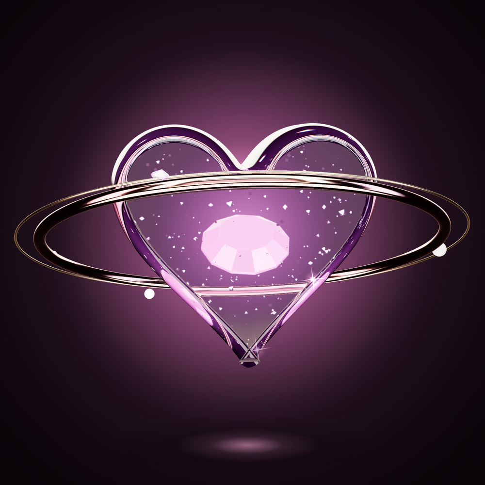
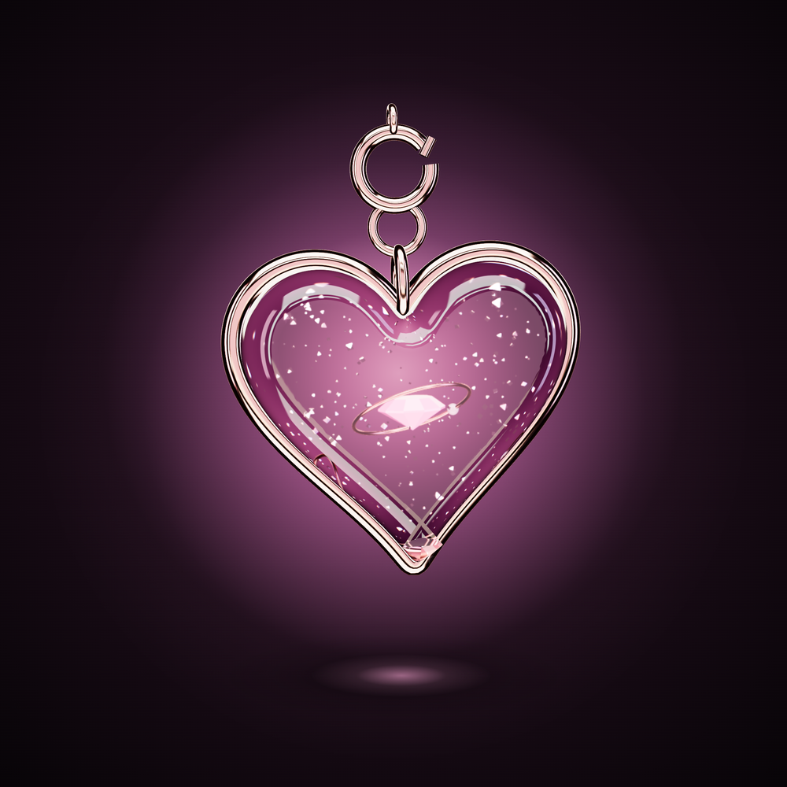
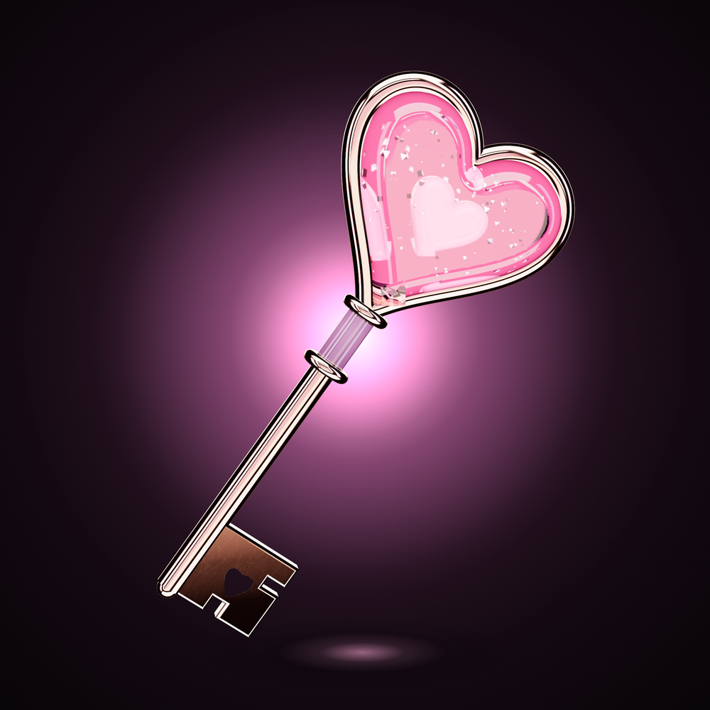

# Hero objects — Orbit Heart · Vibe Heart · Key to You

Все три — **настоящие 3D-рендеры** (three.js, физические материалы, studio light). Файлы лежат в `assets/<id>/`:

| Файл | Что это |
|---|---|
| `master_2048.png` | 2048×2048, **прозрачный фон** (объект + glow + тень + искры) |
| `master_velvet_2048.png` | 2048×2048 на фирменном фоне Velvet Night |
| `marketplace_1000.png` | 1000×1000 для Getgems (`image` в metadata) |
| `animation_1000.mp4` | бесшовный луп 1000×1000, H.264 (`content_url` в metadata) |

Живой просмотр: `cd vibe-nft/engine && python3 -m http.server 8080` → `http://localhost:8080/viewer.html?nft=10-orbit-heart`.

---

## 10 · ORBIT HEART — Legendary · 250 TON

**Visual concept.** Главный символ Vibe: симпатия как гравитация. Крупное сердце из толстого стекла пронзено орбитой. Часть кольца проходит *внутри* стекла и видна преломлённой, поэтому кольцо ощущается продетым насквозь, а не просто висящим рядом. Внутри парит большой огранённый кристалл, по орбите идут жемчужины и мини-кристаллы.

| | |
|---|---|
| **Materials** | толстое iridescent glass (thin-film, dispersion, лавандовая attenuation) · polished rose gold с микро-царапинами · champagne-хайрлайн · emissive brilliant-cut crystal · жемчуг · stardust |
| **Lighting** | Studio Vibe. Pink strip даёт розовый рефлекс на левом плече сердца, accent strips дают «мокрые» блики на кромке. Кристалл светит сам, орбита отражает floor bounce |
| **Color** | Soft Lavender (стекло) · Dusty Pink (кристалл) · Rose Gold · Pearl · Deep Plum (глубина) |
| **Silhouette** | сердце + наклонный эллипс орбиты, который выходит за его края. В 64 px читается как «сердце-планета» |
| **Animation** | **5 с, 3 удара.** Объект поворачивается ±24° вместе с орбитой и плывёт по вертикали. Кристалл делает 1 полный оборот, его свет бьётся с сердцем. Спутники проходят 1–2 круга. Пыль мерцает, 8 искр вспыхивают по очереди |
| **Модуль** | `engine/objects/10-orbit-heart.js` |
| **Metadata** | `metadata/10-orbit-heart.json` |

---

## 01 · VIBE HEART — Uncommon · 10 TON

**Visual concept.** Фирменный кулон: «мы на одной волне». В отличие от Orbit Heart (скульптура) это **украшение**. Тонкий rose-gold ободок, пухлая стеклянная вставка, в ней свой маленький мир: светящийся кристалл, волосяная орбита с жемчужиной и звёздная пыль. Сверху ювелирная фурнитура: бейл, соединительное кольцо и болт-замок.

| | |
|---|---|
| **Materials** | розово-лавандовое стекло · polished rose gold · emissive crystal · pearl bead · stardust |
| **Lighting** | Studio Vibe. Центр стекла подсвечен ореолом фона, поэтому вставка светится, а не темнеет. Ободок ловит три accent strips |
| **Color** | Dusty Pink · Soft Lavender · Rose Gold · Pearl White |
| **Silhouette** | сердце + вертикальная фурнитура сверху = «кулон». Отличается от Orbit Heart с первого взгляда |
| **Animation** | **3 с, 2 удара.** Кулон поворачивается на кольце (±29°) и чуть качается маятником вокруг замка, как настоящее украшение. Мини-орбита делает оборот, бусина идёт навстречу. Кристалл вспыхивает на ударе |
| **Модуль** | `engine/objects/01-vibe-heart.js` |
| **Metadata** | `metadata/01-vibe-heart.json` |

---

## 02 · KEY TO YOU — Uncommon · 10 TON

**Visual concept.** «Ты открыл(а) мне что-то настоящее». Головка ключа — хрустальное розовое сердце в rose-gold рамке, внутри горит маленькое сердце. На стыке воротник из двух колец и лавандовая хрустальная втулка. В бородке прорезано сердце: это и есть механизм, ключ подходит только к одному замку.

| | |
|---|---|
| **Materials** | polished rose gold с микро-царапинами · розовое стекло с glow bed и пылью · лавандовая хрустальная втулка · эмиссионное сердце |
| **Lighting** | Studio Vibe. Подложка glow bed за стеклом даёт головке свет изнутри даже вне ореола. Стержень ловит длинный блик от key light |
| **Color** | Rose Gold · Dusty Pink · Lilac · Pearl |
| **Silhouette** | длинный ключ по диагонали (−35°) с сердцем-головкой и прямоугольной бородкой. Диагональ отличает его от вертикальных и круглых объектов в сетке |
| **Animation** | **3 с.** Ключ медленно поворачивается вокруг своей оси (±49°), как в замке. Когда сердце смотрит на зрителя, оно загорается (`cos⁶` от угла × heartbeat). Лёгкий float, искры на головке и бородке |
| **Модуль** | `engine/objects/02-key-to-you.js` |
| **Metadata** | `metadata/02-key-to-you.json` |

---

## Известные ограничения рендера

- Рендер идёт в реальном времени (three.js + SwiftShader), это не path-tracer. Каустики и микро-царапины сделаны приёмами (слой каустики в тени, roughness-map), а не физической симуляцией. Для витрины уровня «главная Getgems» можно перенести те же сцены в Blender/Cycles: материалы и свет описаны в PBR-параметрах.
- Вложенная прозрачность не рендерится: стекло внутри стекла не видно. Поэтому кристаллы внутри стеклянных тел светятся (emissive), а не преломляют.
- У Orbit Heart на кончике сердца видна маленькая точка преломления там, где сходятся фаски. На 1000 px она едва заметна, но в Cycles-версии её стоит убрать.
